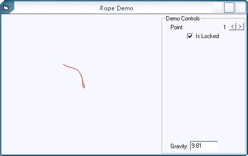



## Rope Physics Demo

### Description

This code demonstrates simple rope physics.

There are bugs in it through, like the rope's line is a bit jumpy and if any point is dragged that is not the first point, the point can be moved anywhere.
 
### More Info
 

             |
---                |---
**Submitted On**   |2006-06-18 13:06:04
**By**             |[Michael Smyer](https://github.com/Planet-Source-Code/PSCIndex/blob/master/ByAuthor/michael-smyer.md)
**Level**          |Intermediate
**User Rating**    |5.0 (20 globes from 4 users)
**Compatibility**  |VB 6\.0
**Category**       |[Math/ Dates](https://github.com/Planet-Source-Code/PSCIndex/blob/master/ByCategory/math-dates__1-37.md)
**World**          |[Visual Basic](https://github.com/Planet-Source-Code/PSCIndex/blob/master/ByWorld/visual-basic.md)
**Archive File**   |[Rope\_Physi2001686182006\.zip](https://github.com/Planet-Source-Code/michael-smyer-rope-physics-demo__1-65704/archive/master.zip)

